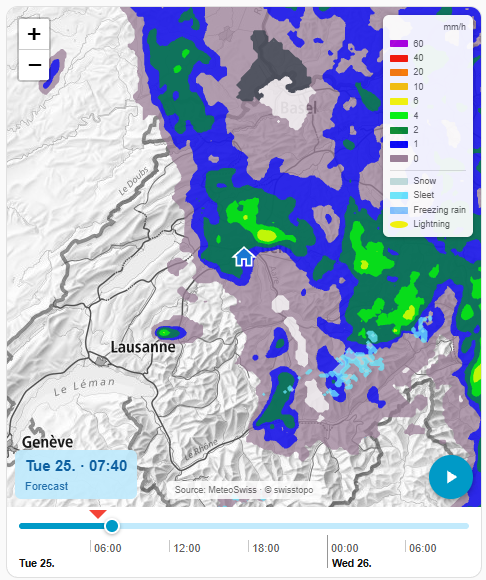

# hass-meteoswiss-radar

MeteoSwiss precipitation radar for Home Assistant: a custom integration that
proxies the MeteoSwiss app API (their endpoints send no CORS headers) and
ships a Lovelace card rendering the radar on a swisstopo basemap with Leaflet.

**Status: work in progress.** The card plays the full radar animation —
~12 h of measurement into ~28 h of INCA forecast — with play/pause, a
flat scrubbing timeline in the HA accent color with hour/date labels, a
measurement/forecast label and an intensity legend overlay, centered on
your home location. The frame list refreshes itself while the
card is open, and upstream breakage degrades to a clean banner instead of a
broken card.

## Screenshot

<!--
  TODO(#18): drop a real card capture at docs/images/card.png and uncomment
  the line below. Kept as a comment so the HACS store page never renders a
  broken image. A live Home Assistant render is required, which cannot be
  produced from CI.
-->
<!--  -->

## How it works

- `custom_components/meteoswiss_radar/` registers an authenticated HTTP proxy
  (`/api/meteoswiss_radar/proxy/...`, allowlisted MeteoSwiss paths only) and
  serves the card bundle, auto-registered on every dashboard — no manual
  resource entry needed, YAML-mode dashboards included.
- The card fetches the radar frames through the proxy and decodes the
  chain-code polygon format documented in [FORMAT.md](FORMAT.md).

## Requirements

- **Home Assistant 2024.7.0 or newer.** The integration uses
  `StaticPathConfig` / `async_register_static_paths` and
  `remove_extra_js_url` (all 2024.7) plus `ConfigFlowResult` (2024.4); older
  installs fail at import with a cryptic `ImportError`.

## Install (HACS)

Not in the default HACS store yet — add it as a custom repository:

1. HACS → three-dot menu → **Custom repositories**.
2. Repository: `https://github.com/chriguschneider/hass-meteoswiss-radar`,
   category: **Integration**. Add.
3. Open **MeteoSwiss Radar** in HACS and **Download** it.
4. **Restart Home Assistant.**
5. Settings → Devices & Services → **Add Integration** → "MeteoSwiss Radar".
6. Add the card to a dashboard:

```yaml
type: custom:meteoswiss-radar-card
```

The card JS is **auto-injected into every dashboard for every user** — the
integration registers it as a frontend resource on setup, so there is no
manual resource entry to add (YAML-mode dashboards included). By the same
token, **uninstalling requires a Home Assistant restart** to fully unload
the integration and stop serving the card.

### Install (manual)

1. Copy `custom_components/meteoswiss_radar/` into your HA `config/custom_components/`.
2. Restart Home Assistant.
3. Settings → Devices & Services → Add Integration → "MeteoSwiss Radar".
4. Add the card as shown above.

The card has a **visual editor** (dashboard card options UI); every option
below can also be set there. The play button cycles three modes: paused ->
play the configured window (looping) -> play the full timeline.

### Options

| Option | Default | Description |
| --- | --- | --- |
| `height` | `400` | Map height in px. |
| `zoom` | `8` | Initial map zoom. |
| `center` | home location | `[lat, lon]` map center; the house marker follows the home location regardless. |
| `frame_duration` | `300` | Milliseconds per animation frame. |
| `frame_stride` | `1` | Play every Nth frame — raise on slow devices. |
| `past_hours` | full range | Hours of measurement history to keep on the timeline. |
| `forecast_hours` | full range | Hours of forecast to keep; `0` gives a measurement-only card. |
| `autoplay_mode` | `off` | `off`, `window` (play the configured window on open, looping) or `full` (play the whole timeline). |
| `play_past_hours` | `1` | Play window: hours of history before now. |
| `play_forecast_hours` | `8` | Play window: hours of forecast after now. |
| `play_forecast_until` | – | Play window: clock time ("20:00") to play at least until — the longer of this and `play_forecast_hours` wins. |
| `legend` | `true` | Show the intensity legend (mm/h) overlay on the map. |
| `attribution` | `true` | Show the "Source: MeteoSwiss · © swisstopo" chip at the bottom center of the map. The swisstopo basemap license requires attribution — disable only for private use at your own discretion. |
| `time_axis` | `true` | Hour and date label rows under the timeline track. |
| `large_label` | `true` | Big date/time label on the map with a Measurement/Forecast line. |

## Attribution

Radar data: [MeteoSwiss](https://www.meteoschweiz.admin.ch). Basemap:
[swisstopo](https://www.swisstopo.admin.ch). This project is not affiliated
with either. Map rendering: [Leaflet](https://leafletjs.com) (vendored).

## License

MIT
